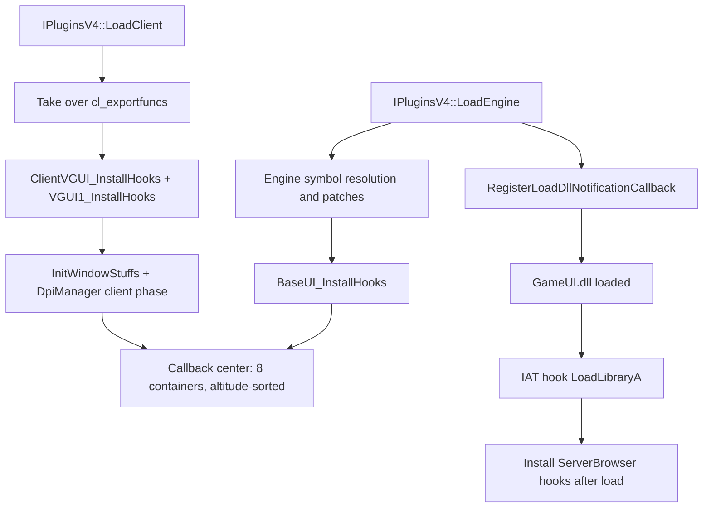

# VGUI2Extension

VGUI2Extension is MetaHook's VGUI2 extension-framework plugin. At runtime it takes over entry points
such as BaseUI, GameUI, ClientVGUI, KeyValues and the game console, and wraps the original VGUI2 calls
into registrable pre/post callback chains so other plugins can extend, intercept or redirect the UI.
It also provides font and HiDPI support, game language overrides and input-method handling, and it
exports the `IVGUI2Extension`, `ISurface2`, `ISchemeManager2`, `IInput2` and `IDpiManager` interfaces.

## Provenance

This repository is the standalone VGUI2Extension plugin, extracted from MetaHookSv
(`Plugins/VGUI2Extension/`) into its own CMake workspace, aligned with the standalone Renderer,
PrecacheManager and HeapPatch projects. The source note
(`metahooksv/memory/VGUI2Extension.md`) is a long, dated migration log written against the original
MetaHookSv checkout. This note merges the still-valid conclusions of that log with the current
repository state; the dated entries themselves are not reproduced, because this repository's rule is
that current code takes precedence over historical notes.

Two conclusions from the source note are **superseded** and deliberately not carried over:

- The note's claim that `IInput2` was bumped to `VGUI_Input2_006` is wrong for this checkout. The
  interface version here is `VGUI_Input2_005`, and it already declares `CancelIMEComposition`; there
  is no 006 factory alias. See the interface table below.
- The note's statement that symbol location "in many places relies on signature scanning and
  disassembly" no longer holds: all private-symbol location is gamedata-only, with no scan fallback
  (see "Symbol resolution").

The `metahooksv` Basic Memory project belongs to the source repository; notes here use the
`vgui2extension` project and the `vgui2extension/` permalink prefix.

## Public interfaces

All five public interface headers are owned by this repository (installed by it, and taking
precedence over MetaHook's historical copies):

| Interface | Version string | Header |
| --- | --- | --- |
| `IVGUI2Extension` | `VGUI2_Extension_API_010` | `include/Interface/IVGUI2Extension.h` |
| `IDpiManager` | `DpiManager_API_001` | `include/Interface/IDpiManager.h` |
| `IInput2` | `VGUI_Input2_005` | `include/Interface/VGUI/IInput2.h` |
| `ISchemeManager2` | `VGUI_Scheme2_002` | `include/Interface/VGUI/IScheme2.h` |
| `ISurface2` | `VGUI_Surface2_005` | `include/Interface/VGUI/ISurface2.h` |

## Responsibilities and entry points

- `src/plugins.cpp`: MetaHook `IPluginsV4` lifecycle. `LoadEngine` reads the engine information,
  resolves the engine symbols, patches `VGUIClient001` and the language-copy call sites, installs the
  BaseUI hooks, initializes the DPI engine phase and registers the DLL-load notification;
  `LoadClient` takes over `cl_exportfuncs`, resolves the client symbols, installs the
  ClientVGUI/VGUI1 hooks and initializes the window/DPI client phase.
- `src/VGUI2ExtensionInternal.cpp`: the callback center — eight registration containers and the
  altitude-sorted pre/post dispatch.
- `src/BaseUI.cpp`, `src/GameUI.cpp`, `src/ClientVGUI.cpp`, `src/VGUI1Hook.cpp`: the concrete
  BaseUI/GameUI/ServerBrowser/client-UI proxies.
- `src/Surface2.cpp`, `src/Scheme2.cpp`, `src/FontManager.cpp`, `src/Win32Font.cpp`,
  `src/FontTextureCache.cpp`, `src/FontAmalgam.cpp`: surface, scheme and font proxies.
- `src/DpiManagerInternal.cpp`: DPI detection, forced proportional HiDPI mode and the `SKIN`
  search-path injection (`*_dpiNNN` / `*_hidpi`).
- `src/InputWin32.cpp`, `src/IMEWindowMessage.h`, `src/exportfuncs.cpp`: the Win32/SDL input-method
  path and native message ownership.
- `src/LanguageRegistry.h`: the legacy engine Steam language-registry override.
- `src/privatefuncs.cpp`: engine/client private-symbol resolution, address patching, the deferred
  GameUI/ServerBrowser loading and the remaining hook entry points.
- `src/KeyValuesSystemHook.cpp`, `src/EngineSurfaceHook.cpp`: KeyValues interception and the engine
  surface globals.

## Architecture

Three layers:

1. **Plugin lifecycle layer** (`plugins.cpp`). `LoadEngine`: engine information, network/engine symbol
   resolution, `VGUIClient001` and language-path patches, BaseUI hooks, DPI engine phase, DLL-load
   notification. `LoadClient`: `cl_exportfuncs` takeover, client private symbols, ClientVGUI/VGUI1
   hooks, window/DPI client phase.
2. **Callback center** (`VGUI2ExtensionInternal.*`). Eight containers —
   `m_BaseUICallbacks`, `m_GameUICallbacks`, `m_GameUIOptionDialogCallbacks`,
   `m_GameUITaskBarCallbacks`, `m_GameUIBasePanelCallbacks`, `m_GameConsoleCallbacks`,
   `m_ClientVGUICallbacks`, `m_KeyValuesCallbacks`. Each is sorted by `GetAltitude()` in descending
   order when a callback registers, and dispatch stops for the remaining plugins once
   `CallbackContext->Result >= VGUI2Extension_Result::HANDLED`.
3. **Hook/proxy layer** (`BaseUI.cpp`, `GameUI.cpp`, `ClientVGUI.cpp`, `SurfaceHook.cpp`,
   `SchemeHook.cpp`, `VGUI1Hook.cpp`). Proxies use the two-stage `CallbackContext` shape: pre-callback
   (`IsPost = false`) → original function (which may be skipped) → post-callback (`IsPost = true`).
   `DllLoadNotification` plus `NewLoadLibraryA_GameUI` handle GameUI.dll / ServerBrowser.dll loading
   after the fact, and the ServerBrowser hooks are installed from that point.

The capabilities declared in `IVGUI2Extension.h` map one-to-one onto the implementation: the
`Register*`/`Unregister*` family onto the eight vectors, `GetBaseDirectory`/`GetCurrentLanguage` onto
`GetBaseDirectory()` and `GetCurrentGameLanguage()`, and the `VGUI2Extension_Result` values
(`HANDLED`/`OVERRIDE`/`SUPERCEDE`/…) onto whether a proxy calls the original and the post-callbacks.

## Symbol resolution

All private symbols come from the host gamedata catalog through the helpers in `src/plugins.h`:
`GamedataResolvePtr` (required — a missing record is fatal with
`Could not resolve gamedata symbol: …`), `GamedataResolvePtrIfAvailable` (optional records such as
`g_iVisibleMouse`, which only the Sven Co-op snapshots publish) and `GamedataResolveVFuncIndex`
(VGUI2 virtual slots). `src/plugins.h` carries
`static_assert(METAHOOK_API_VERSION >= 115, ...)` because the plugin consumes
`mh_gamesymbol_t::vfuncIndex`.

- No signature scan, string search or disassembly walk remains. The only runtime code patching left
  is a handful of gamedata PATCH records redirected with `InlinePatchRedirectBranch`: the
  `Sys_GetFactory(hClientDLL)` call for `VGUIClient001`, the two `V_strncpy` language-copy call
  sites, the GameUI panel sizing call sites and the MessageBox `SetSize` call site. Each of those
  addresses is resolved from the catalog, not searched for.
- `scripts/manifests/vgui2extension.json` is the static consumption contract: 21 game versions,
  92 explicit records across five modules (`engine` 14, `client` 15, `gameui` 57, `serverbrowser` 5,
  `vgui2` 1) plus the five `_0` records of 5 numbered patch sets, with `symbolExemptions` and 17
  `conditionalGroups` carrying the per-game-version conditions. A numbered set can consume further
  records, so 92 is not the size of every installed catalog. `docs/en/gamedata.md` and
  `docs/zh-CN/gamedata.md` document the runtime requirements and the full inventory.
- Host requirement: MetaHook must merge nested catalogs and provide API 115 or newer, with an API
  version at least as new as the SDK the plugin was built against.

## Dependencies

- **MetaHook API**: `VFTHook` / `InlineHook` / `IATHook` / `InlinePatchRedirectBranch` /
  `ResolveGameSymbol` and the load-DLL notification callbacks.
- **VGUI2/GoldSrc interfaces**: `IBaseUI` (and its Legacy/HL25 variants), `IGameUI`,
  `IClientVGUI`, `ISurface` / `ISurface_HL25`, `ISchemeManager`, `IKeyValuesSystem`, plus
  `IEngineSurface` and the engine surface globals.
- **Runtime components**: `GameUI.dll`, `ServerBrowser.dll`, `vgui2.dll`, SDL2, and Win32
  IME/user32.
- **Build**: MetaHook SDK (path or pinned FetchContent), the shared HLSDK/SourceSDK/VGUI sources,
  C++20, static CRT and VC-LTL 5.3.1. SDL2/SDL3 are include-only inputs and are not built or
  packaged here; Capstone/GLEW are leftovers of the original MSBuild prerequisites.

## Runtime behaviour and switches

- Command-line options: `-forcelang` (force a language), `-steamlang` (take the language from
  Steam), `-high_dpi` / `-no_high_dpi` (force or forbid proportional HiDPI mode) and `-nomousespi`
  (disable the mouse-SPI handling in the window path).
- The legacy language override resolves the five-argument `Sys_GetRegKeyValueUnderRoot` function
  where the catalog publishes it; that path selects an inline hook and bypasses the
  `V_strncpy` language patch, while the engines without it keep the patch. Only the complete implicit-HKCU
  `Software\Valve\Steam` / `Language` pair is matched, case-insensitively; nonempty `-forcelang`
  overrides the returned buffer with bounded copying, and the effective value is mirrored to the
  current-language state. `Engine_InstallHooks` runs the `VGUIClient001` patch, the language-copy
  patch and that language-registry hook, and fails with
  `Could not install the engine language registry hook.` if the hook cannot be placed.
- **Native Win32 IME ownership**: IME handling must run *before* the engine's `CGame::WindowProc`,
  because that procedure calls `DefWindowProcA` before BaseUI dispatches, so a BaseUI SUPERCEDE
  cannot suppress the default IME processing. `InitWindowStuffs` therefore installs an inline hook on
  the gamedata-resolved `CGame::WindowProc` (with a fastcall adapter preserving the x86 thiscall
  `ECX` and the `LRESULT` return); `IMEWindowMessage.h` consumes composition/result and `IME_CHAR`
  before the original procedure, forwards ordinary input, and clears the native
  composition/candidate flags before forwarding `IME_SETCONTEXT`. The BaseUI Win32 callback no longer
  submits IME text and the SDL callback ignores `IsPost`. `ShutdownWindowStuffs` removes the hook and
  unregisters the callbacks during `HUD_Shutdown` and `ExitGame`. Real IME behaviour on a
  non-SDL engine has not been verified in this repository — see `memory/build_and_verification.md`.
- `IInput2::CancelIMEComposition` (present in this checkout as part of `VGUI_Input2_005`) cancels an
  existing composition by driving `ImmNotifyIME(NI_COMPOSITIONSTR, CPS_CANCEL, 0)` and then resetting
  the composing state, text, candidate list and flags — even when no HWND/HIMC is available.
  CaptionMod calls it after focusing the chat entry. It cancels an existing composition only; it does
  not gate later input from a still-held activation key.

## Known limitations

- The callback containers have no deduplication and no locking: registering the same callback twice
  produces duplicate callbacks, and concurrent registration/unregistration from threads is not a
  design goal.
- `g_bIsSvenCoop` is declared and initialized to `false`; nothing in this repository sets it to
  `true`, so any branch depending on it is effectively dead.
- `Client_InstallHooks` / `Client_UninstallHooks` and `EngineSurface_InstallHooks` /
  `EngineSurface_UninstallHooks` are empty. Most UI logic lives in the BaseUI/GameUI/ClientVGUI/
  surface/scheme proxies, and the engine surface globals are resolved but no surface vtable hook is
  installed from that entry point.
- Menu handling depends on the Legacy/HL25 layout of the members adjacent to `vgui2::Menu.m_pScroller`,
  and the PropertySheet `_pageTabs` dependency retains the legacy array layout, even though both the
  field offsets and the virtual slots are catalog-resolved.

## Build and data flow

`scripts/build-VGUI2Extension-x86-{Debug,Release}.bat` → CMake (MSVC x86, C++20, static CRT,
VC-LTL 5.3.1) → compile the DLL → install. The explicit compile list in `cmake/Sources.cmake` keeps
the 129 units of the original project (22 plugin units and 107 shared SDK units); the MetaHook SDK is
consumed from `METAHOOK_SOURCE_PATH` or fetched at a fixed commit, and both SDL include arguments are
required.
`scripts/manifests/vgui2extension.json` → `scripts/sync-gamedata.py` → pruned standalone catalog →
validated by `scripts/validate-gamedata.py`; the host recursively merges the installed
`metahook/gamedata/vgui2extension/` directory.
Assets are the two Chinese localization files originally at `Build/svencoop/vgui2ext/` and
`Build/platform/`, installed to the prefix root. Tests cover the language registry, the IME messages
and the pruning of conditionally numbered patches (C++ regression tests under `tests/` via CTest, and
synchronizer behaviour tests under `scripts/tests/` via Python unittest). Build and install output
stays under `build/x86/<configuration>/` and `install/x86/<configuration>/`; nothing is deployed into
the game automatically.

## Callers

Plugins that obtain `VGUI2_EXTENSION_INTERFACE_VERSION` and register callbacks (verified in the
standalone repositories of the MetaHookSv-org workspace):

- CaptionMod (BaseUI/ClientVGUI/GameUI)
- BulletPhysics (BaseUI/ClientVGUI/GameUI)
- Renderer (BaseUI/GameUI)
- SCModelDownloader (BaseUI/GameUI/TaskBar/KeyValues, and others)

Common pattern: `Register*Callbacks(...)` during initialization, `Unregister*Callbacks(...)` on
shutdown, and `VGUI2Extension()->GetCurrentLanguage()` when reading the language.

## External documentation

`README.md` is the English landing page and `README.zh-CN.md` the Chinese one; the structure aligns
with the standalone Renderer and MetaHook. Detailed docs are paginated by build, install, features,
gamedata and CI, in bilingual form under `docs/en/` and `docs/zh-CN/`, with relative links at the top
of each page back to the corresponding README and for language switching. The gamedata page
centralizes the runtime requirements and the symbol list grouped by module/kind/version condition,
containing 92 explicit records and 5 groups of consecutively numbered patches; manifest publication
conditions and source runtime conditions are documented separately — a listing's exemption must not
be treated as runtime optionality.

For build structure and verification status see `memory/build_and_verification.md`.
